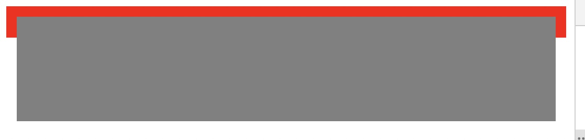

# Q&A

# 目录

1. [Input的size与maxlength 属性的区别？](#Input的size与maxlength-属性的区别？)
2. [BFC IFC GFC FFC](#BFC-IFC-GFC-FFC)

# Input的size与maxlength 属性的区别？

1. Size 表示input输入框可见字符个数，但是可以输入无数个字符

2. maxlength表示输入框可以输入的字符个数

## BFC IFC GFC FFC

1. FC(Formatting Context) 格式化上下文，指的是页面中的一块渲染区域，并有一套渲染规则，它决定**其子元素如何定位，以及和其他元素的关系和相互作用**。

2. BFC(Block Formatting Context)  块格式化上下文，是Web页面的可视CSS渲染的一部分，是块盒子的布局过程发生的区域，也是浮动元素与其他元素交互的区域。

   如何产生BFC？

   + 根元素或其它包含它的元素
   + 浮动元素 (元素的 float 不是 none)
   + 绝对定位元素 (元素具有 position 为 absolute 或 fixed)
   + 内联块 (元素具有 display: inline-block)
   + 表格单元格 (元素具有 display: table-cell，HTML表格单元格默认属性)
   + 表格标题 (元素具有 display: table-caption, HTML表格标题默认属性)
   + 具有overflow 且值不是 visible 的块元素，
   + display: flow-root
   + column-span: all 应当总是会创建一个新的格式化上下文，即便具有 column-span: all 的元素并不被包裹在一个多列容器中。

   总结起来它有两个特性：

   + **BFC内部元素不会导出乱跑**

     ```html
     <style>
       .out {
         border: 10px solid red;
         min-height: 10px;
       }
       .in {
         background-color: grey;
         height: 100px;
       }
     </style>
     <div class="out">
       <div class="in"></div>
     </div>
     ```

     

     在正常文档流中，块级元素是按照自上而下，行内元素是从左到右的顺序排列的。

     如果给里面的一个元素设置浮动或者定位，它就会脱离普通文档流。

     ```html
     <style>
       .out {
         border: 10px solid red;
         min-height: 10px;
       }
       .in {
         background-color: grey;
         height: 100px;
         width: 100%;	// +
         float: left;	// +
       }
     </style>
     <div class="out">
       <div class="in"></div>
     </div>
     ```

     

     此时想让外层元素包裹住内层元素， 就需要让外层元素产生一个BFC。

   + **普通元素与浮动元素产生边界**

     ```html
     <style>
     	.box>div {
       	border: 2px solid red;
       	height: 100px;
       }
       .box .left {
       	float: left;
       	width: 200px;
       	margin-right: 50px;
       }
       .box .right {
       	border-color: blue;
       }
     </style>
     <div class="box">
     	<div class="left"></div>
     	<div class="right"></div>
     </div>
     ```

     

     

     可以看到 right 占据了100%的宽度，且left的margin-right没有产生作用

     此时可以给right增加BFC

     ```html
     <style>
     	.box .right {
     		display: flow-root;
     	}
     </style>
     ```

     

3. IFC(Inline Formatting Contexts) 内联格式化上下文

   IFC(Inline Formatting Contexts)直译为"内联格式化上下文"，IFC的line box（线框）高度由其包含行内元素中最高的实际高度计算而来（不受到竖直方向的padding/margin影响)
   IFC中的line box一般左右都贴紧整个IFC，但是会因为float元素而扰乱。float元素会位于IFC与与line box之间，使得line box宽度缩短。 同个ifc下的多个line box高度会不同。 IFC中时不可能有块级元素的，当插入块级元素时（如p中插入div）会产生两个匿名块与div分隔开，即产生两个IFC，每个IFC对外表现为块级元素，与div垂直排列。
   那么IFC一般有什么用呢？
   水平居中：当一个块要在环境中水平居中时，设置其为inline-block则会在外层产生IFC，通过text-align则可以使其水平居中。
   垂直居中：创建一个IFC，用其中一个元素撑开父元素的高度，然后设置其vertical-align:middle，其他行内元素则可以在此父元素下垂直居中。

4. GFC 网格布局格式化上下文

   GFC(GridLayout Formatting Contexts)直译为"网格布局格式化上下文"，当为一个元素设置display值为grid的时候，此元素将会获得一个独立的渲染区域，我们可以通过在网格容器（grid container）上定义网格定义行（grid definition rows）和网格定义列（grid definition columns）属性各在网格项目（grid item）上定义网格行（grid row）和网格列（grid columns）为每一个网格项目（grid item）定义位置和空间。
   那么GFC有什么用呢，和table又有什么区别呢？首先同样是一个二维的表格，但GridLayout会有更加丰富的属性来控制行列，控制对齐以及更为精细的渲染语义和控制

5. FFC自适应格式化上下文

   FFC(Flex Formatting Contexts)直译为"自适应格式化上下文"，display值为flex或者inline-flex的元素将会生成自适应容器（flex container），可惜这个牛逼的属性只有谷歌和火狐支持，不过在移动端也足够了，至少safari和chrome还是OK的，毕竟这俩在移动端才是王道。
   Flex Box 由伸缩容器和伸缩项目组成。通过设置元素的 display 属性为 flex 或 inline-flex 可以得到一个伸缩容器。设置为 flex 的容器被渲染为一个块级元素，而设置为 inline-flex 的容器则渲染为一个行内元素。
   伸缩容器中的每一个子元素都是一个伸缩项目。伸缩项目可以是任意数量的。伸缩容器外和伸缩项目内的一切元素都不受影响。简单地说，Flexbox 定义了伸缩容器内伸缩项目该如何布局。