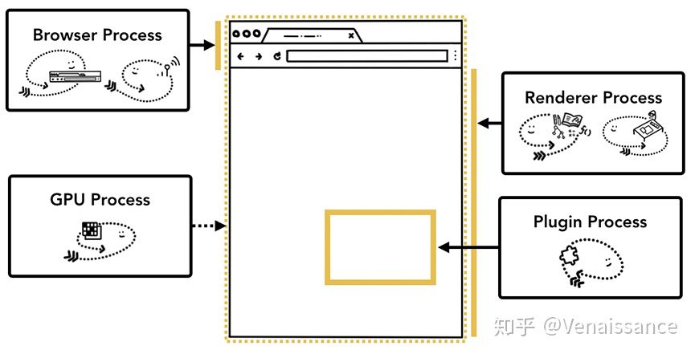

# 从输入URL到页面展示发生了什么

如果说面试官只能问一个问题考察一个人前端知识的广度和深度的话，那一定是从输入URL到页面展示发生了什么。为什么这么说？因为从输入URL到页面展示就是前端的“核心主线”，搞清楚这个问题，就能站在更高维度去理解前端。今天就结合最近一段时间的学习和积累，争取把这条主线尽我所能地讲清楚，帮助大家的同时也帮助自己一次搞定从输入 URL 到页面展示到底发生了什么。

## 浏览器多进程架构

如图，以chrome为例，浏览器分为四个进程

