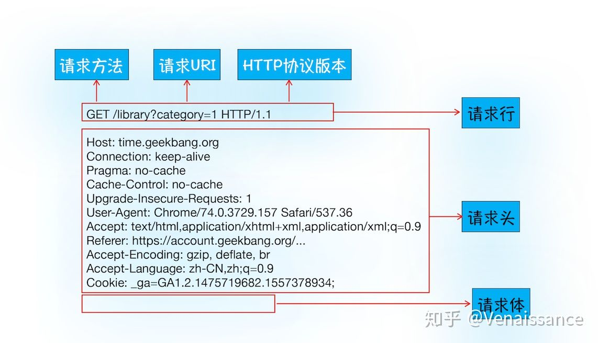
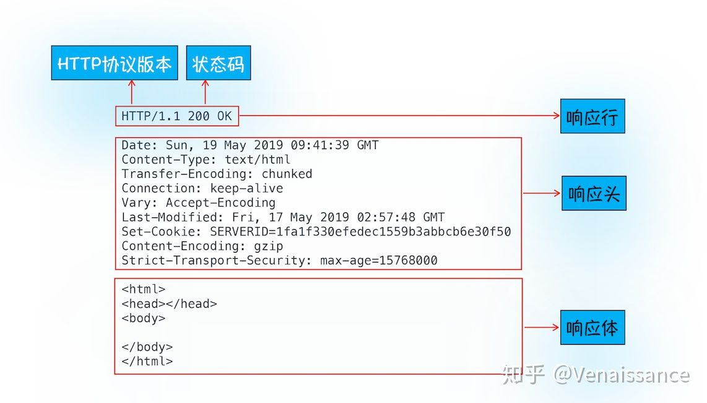
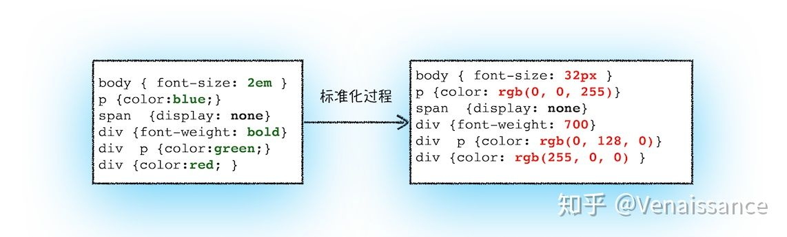

# 从输入URL到页面展示发生了什么

如果说面试官只能问一个问题考察一个人前端知识的广度和深度的话，那一定是从输入URL到页面展示发生了什么。为什么这么说？因为从输入URL到页面展示就是前端的“核心主线”，搞清楚这个问题，就能站在更高维度去理解前端。今天就结合最近一段时间的学习和积累，争取把这条主线尽我所能地讲清楚，帮助大家的同时也帮助自己一次搞定从输入 URL 到页面展示到底发生了什么。

## 1 浏览器多进程架构

以chrome为例，浏览器分为四个进程

1. 浏览器进程（主进程）
+ UI线程，控制浏览器上的按钮、输入框等
+ 网络线程，负责资源的下载
+ 存储线程，负责本地缓存文件的访问

2. 渲染进程，也称浏览器内核
+ js引擎，负责执行js，也是js单线程的由来
+ GUI渲染进程，负责渲染资源，与js引擎互斥，一个运行，另一个挂起
+ 事件触发线程，管理事件循环（鼠标点击、setTimeout、Mutation Observer、Ajax等）， 按顺序把事件放到js执行队列中
+ 定时器线程，setTimeout并不是js的功能，而是浏览器给js开的一个接口
+ 异步请求线程，处理ajax请求，通过回调函数通知事件触发线程

3. GPU进程，负责与GPU（显卡）通信，3D绘制和硬件加速

WebGPU是GPU硬件（显卡）向Web（浏览器）开放的低级应用程序接口（API），包括图形和计算两方面的接口。而WebGL是OpenGL ES低级3D图形API的Web版本。WebGPU和WebGL两者都是对GPU功能的抽象，都是为了提供操作GPU的接口。

GPU是将触发gpu“加速”的元素拿出来，单独放在一个合成层里，这样做的好处是发生在该层中的动画都会单独绘制，其他层就避免了重绘等操作。

合成层会占用系统内存与GPU(在移动设备上尤其有限)的内存，并且拥有大量的合成层会因为记录哪些是可见的而引入额外的开销。

如何触发GPU？
+ 3D或透视变换(perspective，transform) CSS属性
+ 使用加速视频解码的video元素
+ 拥有3D (WebGL)上下文或加速的2D上下文的canvas元素

> 注意⚠️
> position: fixed;
> 元素会被移出正常文档流，并不为元素预留空间，而是通过指定元素相对于屏幕视口（viewport）的位置来指定元素位置。元素的位置在屏幕滚动时不会改变。打印时，元素会出现在的每页的固定位置。fixed 属性会创建新的层叠上下文。***当元素祖先的 transform, perspective 或 filter 属性非 none 时，容器由视口改为该祖先。***

参考： [一文读懂：GPU加速是什么](https://baijiahao.baidu.com/s?id=1564835558133838&wfr=spider&for=pc) [gpu是加速还是合成](https://www.jianshu.com/p/88278b1516fe)

4. 第三方插件， 每个第三方插件使用时候都会创建一个对应的进程

## 2 发生了什么

### 2.1 构建请求

输入url后，主进程中的UI线程会判断用户输入的是query还是url，如果是url，则把url发给网络线程，网络线程会构建请求信息，构建好之后，浏览器就准备发起网络请求。

### 2.2 查找强缓存

浏览器发起请求之前会查找强缓存，如果命中，直接返回对应资源文件的副本。否则进入下一步。

> 浏览器缓存分为强缓存和协商缓存，根本区别就是“是否发送请求”。强缓存就是你的本地文件，可以立马访问；协商缓存是发送请求给服务器，如果服务器有对应资源的更新，就返回更新后的资源文件，如果没有更新，就访问本地缓存的资源文件
> 强缓存在http1.0时代，通过http响应头中的expires（过期时间）来设置，浏览器通过这个时间和用户的本地时间对比来判断是否读区缓存资源；在http1.1中，响应头中加入了cache-control字段，通过设置`cache-controle: max-age=xxx`(xxx单位秒)后过期。如果expires和cache-control同时存在，以cache-control为准。

### 2.3 DNS解析

发送真正的请求之前需要先进行DNS解析，目的是将url转化为服务器的ip地址。先查找本地DNS缓存，找不到再访问DNS服务器，将得到的ip返回。

### 2.4 建立tcp链接

知道ip地址后，就可以向服务器建立链接了，http是基于tcp协议的，通过三次握手建立链接。[tcp协议](./03 三次握手四次挥手.md)

> tcp协议是可靠的链接，就像打电话，两者之间有一条不间断的通道，数据不到达对方，对方就必须要等待，除非对方挂断电话。先说先到，后说后到，有顺序。

> udp协议是不可靠的，就像寄信，它只是把数据发送出去，不保证能够到达目的地。udp不用在客户和服务器之间建立一个连接，且没有超时重发等机制，故而传输速度很快。

### 2.4 发送请求 接收响应

建立了tcp链接后，浏览器和服务器就可以进行通信了。http中的数据就是在这个过程中传输的。

服务器会通过响应行中的状态码告诉浏览器的处理结果，常见状态码如下：

+ 2xx： 成功，最常见的是200 OK
+ 3xx： 需要进一步操作，比如301永久重定向，302临时重定向，304未修改
+ 4xx： 请求出错，比如404未找到资源，403禁止请求, 401没有访问权限
+ 5xx： 服务器出错， 500服务器内部出错（代码错误），502网关错误

### 2.5 查找协商缓存

在上一步中，如果响应行中的状态码为304（Not Modified ），相当于告诉浏览器，“服务器的资源没有修改，和本地缓存的副本一样，从缓存中读取就可以”。当强缓存过期或者设置了`catch-control: no-catch`，就会进行协商缓存。

协商缓存是通过http 1.0中的“Last-Modifed”和http 1.1中的“E-Tag”实现的。

+ Last-modified 规则： 浏览器第一次发送请求，服务器会在响应头中带上last-modified（值为资源的最后修改时间），并返回资源。浏览器下次发送相同的请求时，会把上次收到的last-modified放到请求头中的if-modified-since字段，服务器收到后，会与资源的最后修改时间进行对比，如果相同返回304，如果不同返回200，并返回最新的资源。
+ E-Tag 规则： 与last-modified规则类似，不过浏览器第一次收到的是e-tag（值为资源的唯一标识符），第二次发送的是if-none-match。不同之处是值的类型不一样，且e-tag优先级要比last-modified高。

既然功能类似，为什么http 1.1 要引入e-tag来实现协商缓存？

+ 有些资源会被周期性重写，但内容不一样
+ 有些资源被修改但是没有必要让用户重新下载，比如注释
+ 有些资源的变化时间会小于1秒，last-modified时间粒度不够

### 2.6  断开tcp链接

浏览器接收到资源后，需要断开tcp链接。

### 2.7  解析html 构建dom树

接收到资源后，浏览器的渲染进程会对资源进行渲染和解析。对于html文件，浏览器由它来生成dom树（一种浏览器可以理解的树形结构）。生成过程如下：

1. 转换： 将html代码内容，根据指定的编码方式（如utf-8）翻译成单个字符。
2. 序列化： 将第一步得到的字符，转换成对应的标记，如html、body、head、style、div等。
3. 词法分析： 将这些标记转换为对象，来定义其属性和规则。
4. 构建dom树： 通过上一步生成的对象，知道了他们的父子关系，就可以构建出dom树。

### 2.8 样式计算

1. 将css浏览器能够理解的结构styleSheets，`document.styleSheets`可以查看

2. 转换样式表中的属性值，使其标准化

   

3. 计算出dom每个节点的具体样式，这里涉及样式的继承和选择器的优先级计算

### 2.9 布局

虽然有了dom树和每个节点的样式，但还需要计算出这些dom元素的几何位置，所以接下来就要计算出dom树中**可见**元素的几何位置，这个计算过程叫做布局。这个过程分为两个阶段：

1. 创建布局树
   1. 遍历dom树中所有的可见节点，并把这些节点添加到布局树中
   2. 不可见的元素会被布局树忽略，如head标签下的所有内容，以及display为none的元素
2. 计算布局树节点的实际坐标（过程比较复杂，跳过）

### 2.10 生产图层树

有了布局树并且知道了每个元素的坐标，为什么还需要生产图层树？

因为现代前端页面有着非常复杂多样的效果，比如页面滚动、z-index方向的排序等，为了方便的实现这些效果，渲染进程还需要为特定的节点生成专用的图层， 并生成一颗对应的图层树。

### 2.11 绘制

接下来渲染引擎对图层树中的每个图层进行绘制，渲染引擎会把图层的绘制拆分成很多绘制指令，再把这些指令按照顺序放入待绘制列表，按顺序进行绘制。

### 2.12 栅格化

绘制列表只是用来记录绘制顺序和绘制指令的列表，而实际上绘制操作是由渲染引擎中的合成线程完成的。

很多时候页面长度都会大于viewport视口高度，但是用户只能通过视口看到页面的一部分，所以没必要一次性绘制出所有图层（开销也会很大）。基于这个原因，基于这个原因合成线程会将图层分割为图块（tile）。图块大小通常是256x256 或者 512x512。

然后合成线程会按照视口附近的图块来优先生成位图，这个过程就是栅格化。

栅格化过程都会使用GPU加速生成，这个过程称为快速栅格化或者GPU栅格化，生成的位图保存在GPU内存中。

### 2.13 合成与显示

一旦所有图块都被栅格化，合成线程会生成一个绘制图块的指令，然后将该命令提交给浏览器进程。

浏览器进程有一个叫做viz的组件用来接收合成线程发过来的指令，根据指令将页面内容绘制到内存中，然后再将内存显示到屏幕上。

## 3 总结

渲染的大致流程可以归纳为

1. 渲染进程将html文件转换为浏览器能够读懂的DOM树结构
2. 渲染进程将css样式表转换为styleSheets，并计算生成CssDom树
3. 创建布局树，并计算布局坐标信息
4. 对布局树进行分层，并生成图层树
5. 为每个图层生成绘制列表，按顺序进行绘制
6. 合成线程将图层分割成图块，并进行栅格化转换为位图
7. 合成线程发送绘制指令给浏览器进程
8. 浏览器进程根据指令绘制页面，并显示到显示器上

