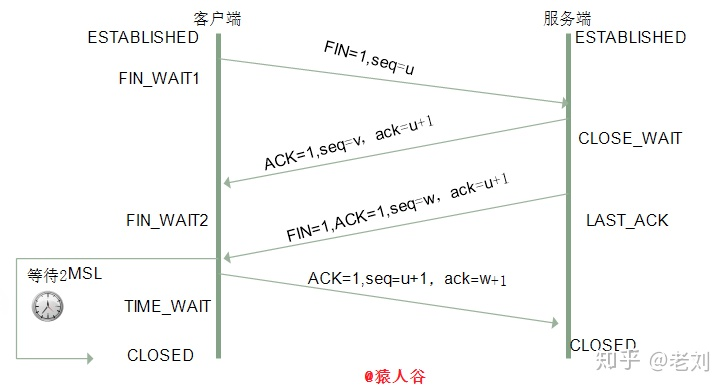

# TCP链接的三次握手和四次挥手

## 三次握手

三次握手指的是建立TCP链接时，需要客户端和服务器共发送三个包。目的是为了确认双方的发送能力和接收能力是否正常，并初始化序列号为后面的可靠性传送做准备。

**TCP之所以可靠，是因为它保证了传送数据包的顺序。顺序是用一个序列号来保证的。（即保证了A请求返回的是服务端响应的A的内容，而不会在网络传输过程中错乱）**

0. 握手前，客户端处于closed状态，服务端处于listen状态
1. 第一次，客户端发送给服务端一个SYN报文，并指明客户端的初始化序列号ISN，此时客户端处于SYN_SEND状态（报文: SYN=1,seq=x）
2. 第二次，服务端收到客户端的SYN报文后，会以自己的SYN报文作为应答，并且也指定了自己的初始化序列号。同时会把客户端的ISN+1作为ACK的值，表明自己收到了客户端的SYN，此时客户端处于SYN_REVD状态（报文:SYN=1，ACK=1，ack=x+1，seq=y）
3. 第三次，客户端接收到服务端的SYN报文，会将服务端的ISN+1作为ACK报文发送给服务端，表示客户端已经收到了服务端的报文，此时客户度啊处于ESTABLISHED（建立的意思）状态，服务端接收到ACK报文后也处于ESTABLISHED状态，此时双方已经建立了链接（报文:ACK=1，ack=y+1，序号seq=x+1）

> SYN: 同步标识，一般为32位的序列号
> ACK: 确认标识，他的值是ISN+1

## 四次挥手

TCP链接的拆除需要发送四个包，因此称为四次挥手，客户端和服务端都可以主动发起挥手动作。挥手前双方都处于ESTABLISHED状态，假如是客户端发起关闭请求（挥手），过程如下

0. 挥手前，客户端和服务端都处于ESTABLISHED状态
1. 客户端发起一个FIN的报文，报文中会指定一个序列号，并停止发送数据，主动关闭tcp链接，之后客户端处于FIN_WAIT1状态， 等待服务端的确认(报文：FIN=1, seq=u)
2. 服务端收到FIN报文后，会发出ACK确认报文，表明已经收到客户端的报文，之后服务端进入CLOSE_WAIT状态(报文：ACK=1，seq=v,ack=u+1)
3. 服务端已经没有要发送的数据，想要断开链接。和客户端第一次挥手一样，发送FIN链接释放报文，服务端进入LAST_ACK(最后确认)状态，等待客户端的确认（报文： FIN=1,ACK=1,seq=w,ack=u+1）
4. 客户端收到FIN报文后，发出确认报文ACK，之后客户端进入TIME_WAIT状态，此时tcp链接未释放，需要等待时间等待计时器设置的2MSL后（目的是确保服务端收到了确认报文），客户端才进入CLOSED状态，服务端收到确认报文后，关闭链接，进入CLOSED状态（报文： ACK=1,seq=u+1,ack=w+1）

## 面试题

1. 请画出三次握手和四次挥手的示意图
2. 为什么连接的时候是三次握手？两次不行吗？

第一次握手，客户端发送报文，服务端接收。此时得出结论： 服务端知道客户端具有发送能力（通过这次握手）

第二次握手，服务端发送确认报文，客户端接收。此时得出结论：客户端知道服务端具有接收（通过这次握手）、发送能力（通过这次握手），服务端知道客户端具有发送能力

第三次握手，客户端收到报文，服务端接收。此时得出结论： 服务端知道客户端有发送能力、接收能力（通过这次握手），客户端知道服务端具有接收、发送能力，

因此需要通过三次握手才能客户端和服务端都确认彼此具有发送和接收能力。

如果使用两次握手：客户端共发出了两个连接请求报文段，其中第一个丢失，第二个到达了服务端，但是第一个丢失的报文段只是在某些网络结点长时间滞留了，延误到第二个连接释放以后的某个时间才到达服务端，此时服务端误认为客户端又发出一次新的连接请求，于是就向客户端发出确认报文段，同意建立连接，不采用三次握手，只要服务端发出确认，就建立新的连接了，此时客户端忽略服务端发来的确认，也不发送数据，则服务端一致等待客户端发送数据，浪费资源。

3. 挥手为什么需要四次？

因为当服务端收到客户端的SYN连接请求报文后，可以直接发送SYN+ACK报文。其中ACK报文是用来应答的，SYN报文是用来同步的。但是关闭连接时，当服务端收到FIN报文时，很可能并不会立即关闭SOCKET，所以只能先回复一个ACK报文，告诉客户端，“你发的FIN报文我收到了”。只有等到我服务端所有的报文都发送完了，我才能发送FIN报文，因此不能一起发送。故需要四次挥手。
